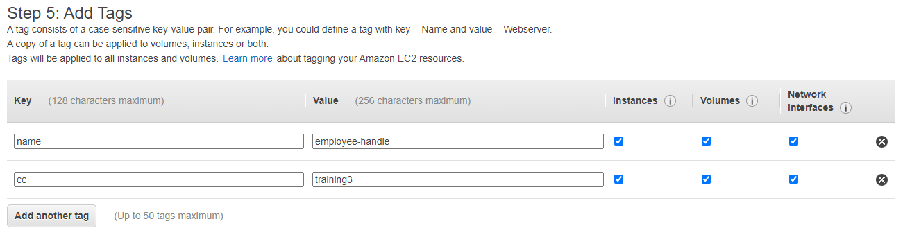
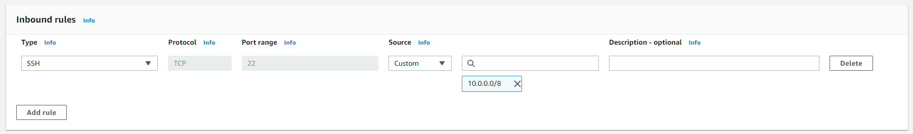

# Ground rules

1. All the participants will be muted by default, please keep it muted. If you have any query then you can unmute yourself and ask me. This way we can have a smooth session without any background noises.

1. Recording of the session is now allowed. So, please don't use the sharing tools recording feature.

1. Any resources created in the AWS account have to be tagged as shown below. This way we can keep track of who has created a particular resource and also helps with the billing. Note that tags are case sensitive and lets use lower case.

1. Keep the resource usage to the minimum, like create an EC2 instance with t2.micro where ever possible.

1. Also, undo the resource creation once done with the lab. Like terminating an EC2 instance, deleting an S3 bucket etc. This would keep the billing to the minimum and also minimize the security risk.

# Creating resources in VPC (EC2, RDS, Aurora etc)

## Option 1 (with VPN)

1. Make sure you are connected to the VPN.

1. Select the **spoke** VPC.

1. Make sure to select the subnet which doesn't have a word **reserved** in it.

1. While creating the Security Group, make sure that the Inbound rules has **10.0.0.0/8** for the source as shown below. This will allow connection to the AWS resources from the McAfee network.

## Option 2 (without VPN)

1. Select the **default** VPC.

1. While creating the Security Group, make sure that the Inbound rules has **0.0.0.0/8** for the source. This will allow connection to the AWS resources from the McAfee network.