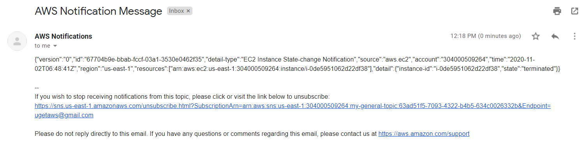

# Topics

    - What is SQS? Integration of the applications with SQS (Python, NodeJS).
    - What is SNS? Difference between SNS and SQS.
    - What is Event Bridge? Using it for notification around AWS Resource changes.

# SQS (Simple Queue Service)

## Theory

SQS is a service from AWS to create highly scalable, reliable and distributed applications. Till now this was achieved using some of the queuing software like IBM MQ, ActiveMQ, Apache Kafka etc. Which each of these we need to take care of
    - Licensing
    - Installation
    - Upgradation
    - Patching
    - High Availability
    - Scalability

SQS is a managed services and all the above tasks are taken care by AWS automatically. All we need to create a queue, put a message in it and get the message from it.\

## Practicals (common for Python and NodeJS)

1. Create an AWS SQS from the Management Console by giving a name with all the default options. Note down the Queue URL and Queue ARN.\

1. Create two EC2 instances.

1. Create an IAM Roles with Custom Policy (using sqs-receive-delete-permissions.json and sqs-send-permissions.json) and attach them to the EC2 instances to give permissions to the applications on the EC2 instances.

1. Install Boto3 SDK for Python or Node.js SDK for JavaScript.

1. Run the below commands on the EC2 instances to specify the default region.

    >mkdir .aws\
    >echo -e "[default]\nregion=us-east-1" > .aws/config

## Practicals (Python)

1. Copy `sqs-python-code\send_message.py` and `sqs-python-code\get_message.py` to the EC2 instances into the folder. Make sure to replace the Queue URL in the code. The location of the Python3 files doesn't matter.

1. On the first EC2 instance execute the below command to put a message in the Queue.

    >python3 send_message.py "1000 USD TRANSFERRED FROM ACCOUNT 123 to ACCOUNT 456"

1. On the second EC2 instance execute the below command to get the message from the Queue. The message should be displayed on the console.

    >python3 get_message.py

## Practicals (NodeJS)

1. Copy `sqs-js-code\send_message.js` and `sqs-js-code\get_message.js` to the directory in the EC2 instances where `aws-sdk` module has been installed. Make sure to replace the Region and the Queue URL in the code.

1. On the first EC2 instance execute the below command to put a message in the Queue.

    >node send_message.js

1. On the second EC2 instance execute the below command to get the message from the Queue. The message should be displayed on the console.

    >node get_message.js

## Further Reading

1. How Amazon SQS works
    - https://docs.aws.amazon.com/AWSSimpleQueueService/latest/SQSDeveloperGuide/sqs-how-it-works.html

1. Amazon SQS features
    - https://aws.amazon.com/sqs/features/

1. Amazon SQS FAQs
    - https://aws.amazon.com/sqs/faqs/

# SNS (Simple Notification Service)

## Theory

Amazon Simple Notification Service (Amazon SNS) is a fully managed messaging service for both application-to-application (A2A) and application-to-person (A2P) communication.

The A2A pub/sub functionality provides topics for high-throughput, push-based, many-to-many messaging between distributed systems, microservices, and event-driven serverless applications. Using Amazon SNS topics, your publisher systems can fanout messages to a large number of subscriber systems including Amazon SQS queues, AWS Lambda functions and HTTPS endpoints, for parallel processing. The A2P functionality enables you to send messages to users at scale via SMS, mobile push, and email.\

## Practicals (common for Python and NodeJS)

1. From the SNS Management Console, create a Standard Topic with all the default options. Simply give a name.

## Practicals (Python)

1. Copy the `create_subscription.py` and `publish_message.py` to the EC2 instances. In the `create_subscription.py` make sure to replace the Topic ARN and the email address. And in the `publish_message.py` make sure to replace the Topic ARN.

1. Create a subscription by executing the below command. An email would be sent, click on the `Confirm subscription` link in the email to confirm the subscription.

    >python3 create_subscription.py

1. Publish a message to the Topic by executing the below command. Make sure an email has been got from SNS. Some times the email might go into the email spam folder.

    >python3 publish_message.py

## Practicals (NodeJS)

1. Delete the subscription from the SNS Management Console.

1. Copy the `create_subscription.js` and `publish_message.js` to the EC2 instances. In the `create_subscription.js` make sure to replace the Topic ARN and the email address. And in the `publish_message.js` make sure to replace the Topic ARN. In both the files the Region (us-east-1) also needs to be specified.

1. Create a subscription by executing the below command. An email would be sent, click on the `Confirm subscription` link in the email to confirm the subscription.

    >node create_subscription.js

1. Publish a message to the Topic by executing the below command. Make sure an email has been got from SNS. Some times the email might go into the email  spam folder.

    >node publish_message.js

## Further Reading

1. Getting Started with Amazon SNS
    - https://aws.amazon.com/sns/getting-started/

1. Amazon SNS features
    - https://aws.amazon.com/sns/features/

1. Amazon SNS FAQs
    - https://aws.amazon.com/sns/faqs/

## EventBridge

## Theory

Amazon EventBridge is a serverless event bus that makes it easy to connect applications together using data from your own applications, integrated Software-as-a-Service (SaaS) applications, and AWS services.

Use cases :
1. Customer support - any change in the status of the ticket
1. Security operations - 3rd party integration with security products
1. Application monitoring - changes in application performance
1. Directory registration - new user registration
1. Customer data updates - changes to the data in the CRM application

EventBridge is more flexible than SQS in the number of event sources and targets it supports. It makes it easier to create plumbing of event sources and targets. For your example, EventRules supports S3 Events as a source and Step Functions as a target.

## Practicals

In this lab we will go with the assumption that we have an important application on top of EC2 instance and would like to get notified when the EC2 gets terminated.

1. We will leverage the SNS Topic and Subscription from the previous demo.

1. Launch and EC2 using the EC2 Launch Template.

1. Go to the EventBridge Management Console. Click on `Create rule`.

1. Give the rule the `EC2-Termination-Rule` name.

1. Select `Event Pattern` and `Pre-defined pattern by service`.

1. For `Service Provider` select AWS.

1. For `Service name` select EC2.

1. For `Event type` select `EC2 Instance State-change Notification`.

1. Select `Specific state(s)` and select `terminated`.

1. Select `Specific instance Id(s)` and enter the Instance ID of the previously created instance. The Event pattern would be similar to as shown below.\

1. For the Target select `SNS Topic`.

1. Select the Topic created in the previous step.

1. Click on `Create`. The Rule would be created as shown below.\

1. Go back to the EC2 Management Console and terminate the EC2 instance.

1. An email would be sent by SNS for the EC2 getting terminated status as shown below.\

## Further Reading

1. A comparison of EventBridge & Other AWS Services
    - https://www.rajeshbhojwani.co.in/2019/12/a-comparison-of-eventbridge-other-aws.html

1. Getting started
    - https://docs.aws.amazon.com/eventbridge/latest/userguide/eventbridge-getting-set-up.html

1. EventBridge Event Examples from Supported AWS Services (Sources)
    - https://docs.aws.amazon.com/eventbridge/latest/userguide/event-types.html

1. Targets supported in the EventBridge
    - https://docs.aws.amazon.com/eventbridge/latest/userguide/eventbridge-targets.html

1. Tutorials around EventBridge
    - https://docs.aws.amazon.com/eventbridge/latest/userguide/eventbridge-tutorials.html

1. Schedule Automated Amazon EBS Snapshots Using EventBridge
    - https://docs.aws.amazon.com/eventbridge/latest/userguide/take-scheduled-snapshot.html

1. Schedule Expressions for Rules
    - https://docs.aws.amazon.com/eventbridge/latest/userguide/scheduled-events.html

## General References

1. AWS Messaging
    - https://aws.amazon.com/messaging/

1. Introduction to Messaging for Modern Cloud Architecture
    - https://aws.amazon.com/blogs/architecture/introduction-to-messaging-for-modern-cloud-architecture/

1. Application Integration Using Queues and Messages
    - https://aws.amazon.com/blogs/architecture/application-integration-using-queues-and-messages/

1. Migrating from IBM MQ to Amazon MQ using a phased approach
    - https://aws.amazon.com/blogs/compute/migrating-from-ibm-mq-to-amazon-mq-using-a-phased-approach/