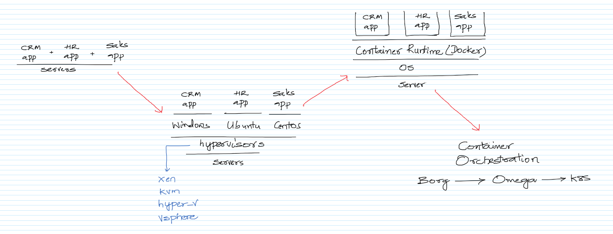
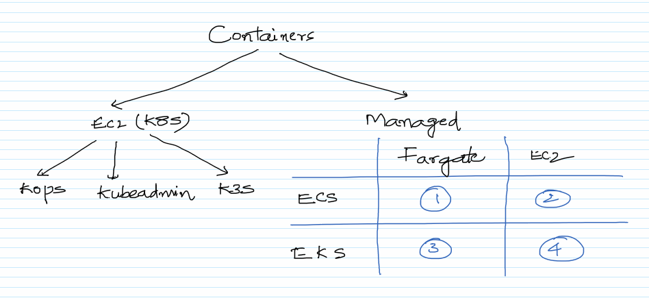
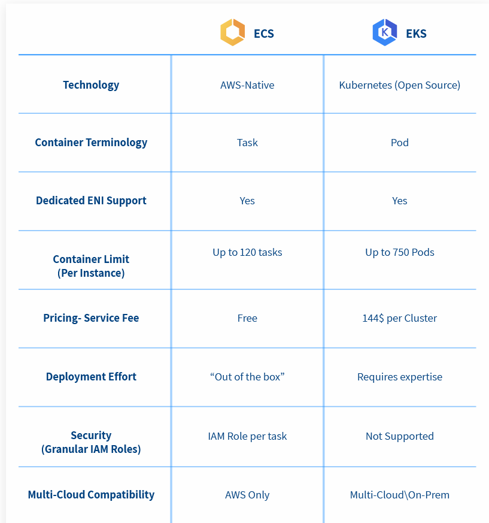
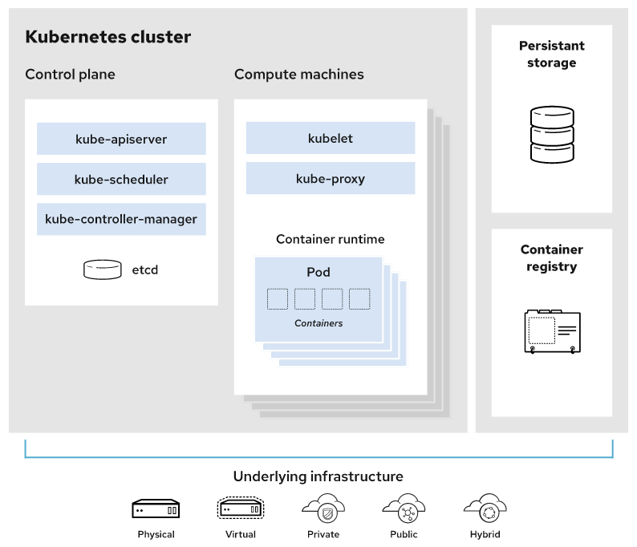
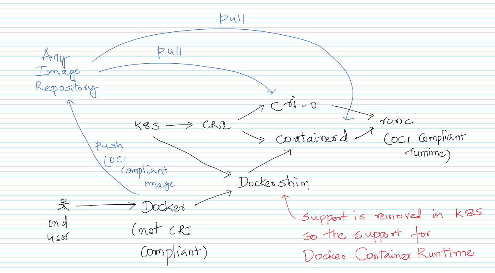

# Topics

    - Introduction to Docker and K8S
    - How are AWS and K8S related to each other
    - Different ways of setting up an ECS and EKS Cluster in AWS
    - Creating a Docker Container with a static page
    - Registering the Container with AWS ECR
    - Setting up an EKS Cluster with Fargate and deploy above container
    - Setting up an ECS Cluster without Fargate and deploy above container

# Theory

1. Evolution towards containers\

1. Container orchestration on AWS\

    - Amazon ECS vs Amazon EKS: making sense of AWS container services
        - https://aws.amazon.com/blogs/containers/amazon-ecs-vs-amazon-eks-making-sense-of-aws-container-services/

1. Pod (basic unit) Orchestration with K8S\

1. K8S Workloads (https://kubernetes.io/docs/concepts/workloads/controllers/)
    - Deployments
    - ReplicaSet
    - StatefulSets
    - DaemonSet
    - Jobs
    - CronJob

1. K8S Architecture
    - https://kubernetes.io/docs/concepts/overview/components/
    - https://www.redhat.com/en/topics/containers/kubernetes-architecture\

1. Ecosystem
    - https://www.cncf.io/projects/

1. Beneath the container runtime\
\
`Runc` is a low-level, lightweight, portable container runtime. Runc is a tool for spawning and running containers according to the Open Container Initiative (OCI) specification. `Containerd` builds on top of it, and adds higher-level features, such as image transfer and storage, container execution, and supervision, as well as network and storage attachments. There exist alternative implementations of the OCI specification. Some of them are rkt by CoreOS, CRI-O by RedHat, and LXD by Linux Containers. However, containerd at this time is by far the most popular container runtime and is the default runtime of Kubernetes 1.8 or later and the Docker platform.

# Further Reading

# Docker and K8S

1. Docker Base Image OS Size Comparison
    - https://www.brianchristner.io/docker-image-base-os-size-comparison/

1. Amazon Linux container image
    - https://docs.aws.amazon.com/AmazonECR/latest/userguide/amazon_linux_container_image.html

1. Cloud Native Computing Foundation
    - https://www.cncf.io/

1. K8S Documentation
    - https://kubernetes.io/docs/home/

1. K8S Blog
    - https://kubernetes.io/blog/

1. K8S Certifications
    - https://www.cncf.io/certification/cka/
    - https://www.cncf.io/certification/ckad/

1. CNCF Projects
    - https://www.cncf.io/projects/

# EKS

1. Getting started with eksctl
    - https://docs.aws.amazon.com/eks/latest/userguide/getting-started-eksctl.html

1. Getting started with the AWS EKS Management Console
    - https://docs.aws.amazon.com/eks/latest/userguide/getting-started-console.html

1. Deploy a sample Linux workload on EKS
    - https://docs.aws.amazon.com/eks/latest/userguide/sample-deployment.html

1. Using Amazon ECR Images with Amazon EKS
    - https://docs.aws.amazon.com/AmazonECR/latest/userguide/ECR_on_EKS.html

1. Managed node groups
    - https://docs.aws.amazon.com/eks/latest/userguide/managed-node-groups.html

1. Consistent OIDC authentication across multiple EKS clusters using Kube-OIDC-Proxy
    - https://aws.amazon.com/blogs/opensource/consistent-oidc-authentication-across-multiple-eks-clusters-using-kube-oidc-proxy/

1. AutoScaling
    - Cluster Autoscaler - https://docs.aws.amazon.com/eks/latest/userguide/cluster-autoscaler.html
    - HPA - https://docs.aws.amazon.com/eks/latest/userguide/horizontal-pod-autoscaler.html
    - VPA - https://docs.aws.amazon.com/eks/latest/userguide/vertical-pod-autoscaler.html

1. Load Balancing
    - https://docs.aws.amazon.com/eks/latest/userguide/load-balancing.html
    - https://docs.aws.amazon.com/eks/latest/userguide/alb-ingress.html

# ECS

1. Getting started with Amazon ECS using Amazon EC2
    - https://docs.aws.amazon.com/AmazonECS/latest/developerguide/getting-started-ecs-ec2.html

1. Getting started with Amazon ECS using Fargate
    - https://docs.aws.amazon.com/AmazonECS/latest/developerguide/getting-started-fargate.html

1. Getting started with Windows containers
    - https://docs.aws.amazon.com/AmazonECS/latest/developerguide/ECS_Windows_getting_started.html

1. Using Amazon ECR images with Amazon ECS
    - https://docs.aws.amazon.com/AmazonECR/latest/userguide/ECR_on_ECS.html