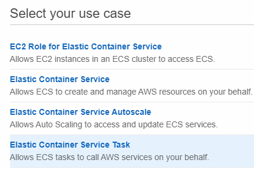

# Creating ECS Cluster using Fargate

1. Create an IAM Role for `Elastic Container Service` with the `AmazonECSTaskExecutionRolePolicy` and call it `ecsTaskExecutionRole`. Note down the `Role ARN`.\

1. In the CloudWatch Management Console, create a `Log groups` called `/ecs/fargate-task-definition`.

1. Navigate to the ECS Management Console and go to the `Task Definitions`. Click on `Create new Task Definition`.\

1. For the launch type compatibility select `FARGATE`. Click on `Next step`.\

1. Navigate to the bottom of the screen and click on `Configure via JSON`.\

1. Copy the task definition from the `ecs-task-definition-fargate.json` file and paste it. Make sure to replace the `executionRoleArn`. Click on `Save`. Click on `Create`. Here the task definition is using an `httpd` image, but the image which has uploaded to the ECR can also be used.

1. Navigate to the `Clusters` tab and click on `Create Cluster`.\

1. For the cluster template select `Networking only`. Click on `Next step`.\

1. Give the cluster a name `my-ecs-cluster-fargate` and finally click on `Create`. The ECS Fargate Cluster would be created as shown below in a few seconds.\

1. Under the `Services` tab click on `Create` with the below details.
    - For Launch type, select EC2
    - For Task definition, select the task definition created in previous step.
    - For Cluster, select the cluster you created in previous steps.
    - For Service name, enter the name of the service `my-ecs-service`.
    - For Number of tasks, enter 1.
    - Finally click on `Next step`.

1. For the `Configure network` screen.
    - Select the default VPC for the `Cluster VPC`.
    - Select one of the Subnets.
    - Click on `Next step`.

1. For the Auto Scaling, go with the default options. Click on `Next step`.

1. Review all the details and click on `Create Service`. Click on `View Service`.

1. In a few seconds the tasks under the service would be in `RUNNING` state as shown below.

1. Click on the `Task`. Under the `Network` section, grab the `Public IP` and open the same in the browser.

1. Select the service and delete it. And finally, delete the cluster.