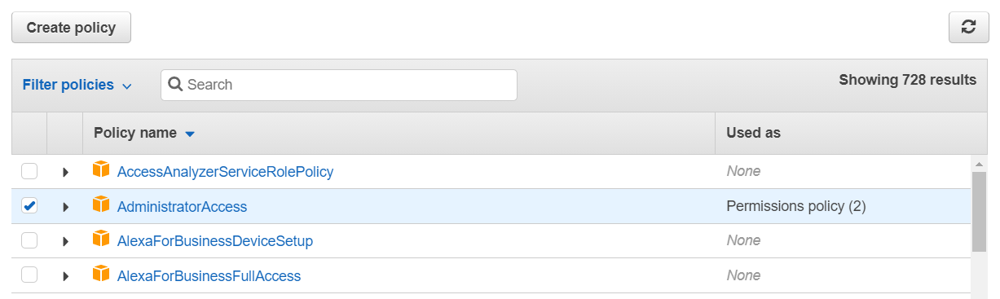
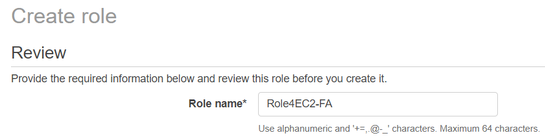
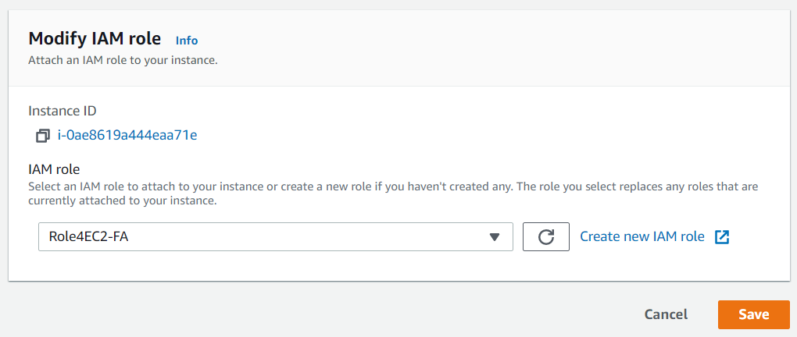

The AWS CLI, Python SDK (Boto3) and Node.js can be installed on the EC2 and also on the non-EC2 (Laptop/Server etc). Both Windows and Linux OS are supported.\

# Installing AWS CLI for Windows

1. Download and install the AWS CLI as like any other software on Windows.
    - https://docs.aws.amazon.com/cli/latest/userguide/install-cliv2-windows.html

1. Once the installation is done, confirm the same by running the `aws --version` command.

# Installing AWS CLI for Ubuntu

1. Create an Ubuntu EC2 instance and execute the below commands.
    >sudo apt-get update\
    >sudo apt-get install python3 python3-pip -y\
    >pip3 install awscli --upgrade\
    >export PATH="$PATH:/home/ubuntu/.local/bin/"

    https://docs.aws.amazon.com/cli/latest/userguide/install-linux.html

# To give the permissions to **non-EC2** instances like laptops/server

1. Generate the credentials from the [this](https://console.aws.amazon.com/iam/home?region=us-east-1#/home) link.
    - Click on `Users` tab in the left pane.
    - Click on the user email.
    - Click on `Security Credentials` tab.
    - Click on `Create New Access Key`.
    - Note down the keys.

1. Run the `aws configure` command to specify the above keys and the region (us-east-1 for North Virginia). For the default output format leave blank.

# To give the permissions to sthe **EC2** instances

1. Navigate to the IAM Management Console. Click on the Roles tab. Click on `Create Role`.

1. Select EC2 as shown below and click on `Next: Permissions`.\

1. Select the `AdministratorAccess` policy as shown below. Click on `Next: Tags`. Click on `Next: Review`.\

1. Give the Role a name and click on `Create role`.`

1. Attach the Role to the EC2 once the EC2 is in a `Running` state as shown below.`\

1. Run the `aws configure` command on the EC2 to specify **only** the default region (us-east-1 for North Virginia). Rest of the options can be left.

# Execute the below commands to manage the AWS resources

1. Create the Security Group and open port 22. In the commands below, make sure to replace the vpc-id (can be got from the VPC Console), group-id(can be got from the EC2 Console).
    >aws ec2 create-security-group --group-name MySecurityGroup --description "My security group" --vpc-id vpc-1a2b3c4d\
    >aws ec2 authorize-security-group-ingress --group-id sg-1234567890abcdef0 --protocol tcp --port 22 --cidr 203.0.113.0/24

1. Get the subnets in the VPC
    >aws ec2 describe-subnets

1. Create an EC2 from the web console.

1. Terminate the instance (make sure to replace the instance-ids from the web console)
    >aws ec2 terminate-instances --instance-ids i-032154634c23e4868

1. Get the list of buckets
    >aws s3api list-buckets

1. Create an S3 bucket
    >aws s3api create-bucket --bucket my-bucket-praveen

1. Create a file and upload to S3
    >echo "Welcome to AWS" > somefile.txt\
    >aws s3api put-object --bucket my-bucket-praveen --key somefile.txt --body somefile.txt

1. Delete the file from S3
    >echo "{ \"Objects\": [ { \"Key\": \"somefile.txt\" } ] }" > file.json\
    >aws s3api delete-objects --bucket my-bucket-praveen --delete file://file.json

1. Delete the bucket
    >aws s3api delete-bucket --bucket my-bucket-praveen

1. Get more commands from the below CLI Reference Guide (v2) and try them out.

# Further Reading

1. CLI Reference Guide
    - https://docs.aws.amazon.com/cli/latest/reference/ (v1)
    - https://awscli.amazonaws.com/v2/documentation/api/latest/index.html (v2)

1. AWS CLI v1 vs v2
    - https://www.youtube.com/watch?v=U5y7JI_mHk8
    - https://docs.aws.amazon.com/cli/latest/userguide/cliv2-migration.html

1. Configure Auto Completion with the CLI
    - https://docs.aws.amazon.com/cli/latest/userguide/cli-configure-completion.html

1. s3 vs s3api commands
    - https://aws.amazon.com/blogs/developer/leveraging-the-s3-and-s3api-commands/