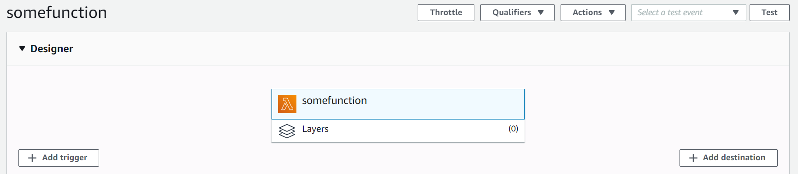
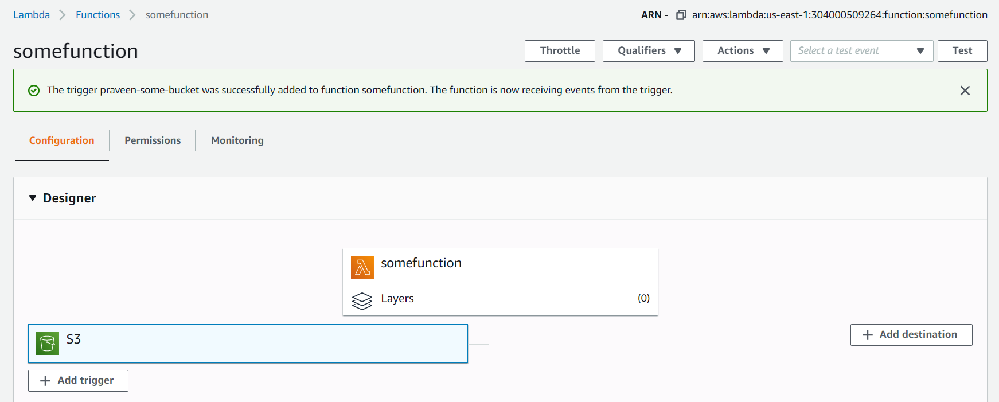
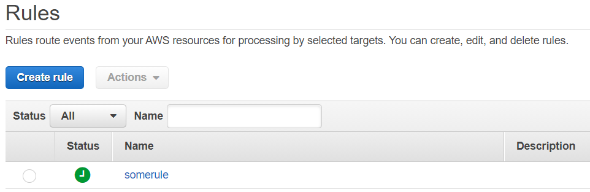

# Topics

    - What is Serverless? The different services around serverless from AWS.
    - Introduction to Lambda. Different ways of invoking Lambda.
    - Invoking Lambda via CloudWatch Scheduler and CloudWatch Events  (Python, NodeJS).

# Theory

[Serverless](https://aws.amazon.com/elasticache/) is a different mindset where we don't need to think about servers. Since, we don't need to think about servers, we don't need to worry about the below aspects. AWS will take care of them us and we can focus more on the business.

- Capacity Planning
- Scalability
- Availability
- Provisioning
- Reliability

SNS, SQS, SES, S3 along with Lambda are a few AWS Services which follow the serverless model. The bad thing about Lambda is the code is specific to the AWS and has to be ported/migrated before running it in some other Cloud. Knative allows to run functions in a Cloud agnostic way.

A Lambda function can be invoked in different ways:

1. **Event Driven** - When a particular event happens in AWS, the AWS can be triggered automatically. For ex., when an file has been uploaded to S3 then a Lambda can be invoked to start a workflow, notify an external application or send an email via SES. This is what we would be doing in this lab.

1. **Schedule** - The Lambda can function can be scheduled at regular intervals like 28th of every month to calculate the payroll of the employees. To start/stop an EC2 automatically Monday to Friday at 9AM and 7PM respectively. The same can be done via the CloudWatch.

1. **Integrate programmatically** - Lambda can also be invoked programmatically by also using the [API Gateway Service](https://aws.amazon.com/api-gateway/). API Gateway Service also provides some of the features including traffic management, CORS support, authorization and access control, throttling, monitoring, and API version management.

# Practical

1. Go to the SES Management Console using the below link and verify two email addresses.
    - https://console.aws.amazon.com/ses/home?region=us-east-1#verified-senders-email:

1. Create a IAM Role for Lambda with the Administrator Access.\

1. Create a bucket in S3.

1. Go to the Lambda Management Console. Click on `Create function`.

1. Give the function a name.

1. Select the platform as `Python 2.7` or `Node.js 12.x`.

1. Under `Change default execution role` choose `Use an existing role` and select the role created in the previous step. Click on `Create function`.

1. Copy the `lambda-send-ses-email.py` or `lambda-send-ses-email.py` code into the screen. Make sure to replace the SENDER and the RECIPIENT email address with the ones which have been verified in the SES.

1. Click on `Add trigger`.\

1. Make sure to select the properties as shown below.\

1. Select `I acknowledge .....` and click on `Add`. The trigger should be added to the Lambda function as shown below.\

1. Click on `Deploy`.

1. Go back to the S3 Management Console and upload a file.

1. The above will trigger a Lambda function which will send an email via SES as shown below.\

1. Naviagte to the CloudWatch Management Console. Go to `Events -> Rules`.

1. Click on `Create rule`. Select `Schedule`.

1. For the `Cron expression` enter `0/15 * * * ? *` as shown below.\

1. Click on `Add target` and select the Lambda Function created earlier.\

1. Click on `Configure details`, give the rule a name and click on `Create rule`.

1. Now the Rule would be created as shown below and the Lambda function would be automatically called every 15 minutes, until we delete or disable the rule.\

# Further Reading

1. Home Page
    - https://aws.amazon.com/lambda/

1. AWS Serverless
    - https://aws.amazon.com/serverless/

1. Firecracker (VM technology for Fargate and Lambda) and BottleRocket (Container OS for K8S for customers)
    - https://aws.amazon.com/blogs/aws/firecracker-lightweight-virtualization-for-serverless-computing/
    - https://aws.amazon.com/about-aws/whats-new/2018/11/firecracker-lightweight-virtualization-for-serverless-computing/
    - https://aws.amazon.com/bottlerocket/

1. Use AWS PrivateLink to Access AWS Lambda Over Private AWS Network
    - https://aws.amazon.com/blogs/aws/new-use-aws-privatelink-to-access-aws-lambda-over-private-aws-network/

1. Shrinking an S3 image with NodeJS
    - https://docs.aws.amazon.com/lambda/latest/dg/with-s3-example.html

1. Collation of articles on Serverless Architecture
    - https://aws.amazon.com/blogs/architecture/ten-things-serverless-architects-should-know/

1. How to Design Your Serverless Apps for Massive Scale
    - https://aws.amazon.com/blogs/architecture/how-to-design-your-serverless-apps-for-massive-scale/

1. Bootstrapping a Java Lambda application with minimal AWS Java SDK startup time using Maven
    - https://aws.amazon.com/blogs/developer/bootstrapping-a-java-lambda-application-with-minimal-aws-java-sdk-startup-time-using-maven/

1. Lambda Concurrency
    - https://docs.aws.amazon.com/lambda/latest/dg/configuration-concurrency.html
    - https://docs.aws.amazon.com/lambda/latest/dg/invocation-scaling.html

1. Replacing web server functionality with serverless services
    - https://aws.amazon.com/blogs/compute/replacing-web-server-functionality-with-serverless-services/

1. Choosing between AWS Lambda data storage options in web apps
    - https://aws.amazon.com/blogs/compute/choosing-between-aws-lambda-data-storage-options-in-web-apps/

1. Code Guru (Profiling and Reviewing)
    - https://aws.amazon.com/codeguru/features/

1. AWS Lambda layers
    - https://docs.aws.amazon.com/lambda/latest/dg/configuration-layers.html

1. Schedule Expressions for Rules
    - https://docs.aws.amazon.com/AmazonCloudWatch/latest/events/ScheduledEvents.html