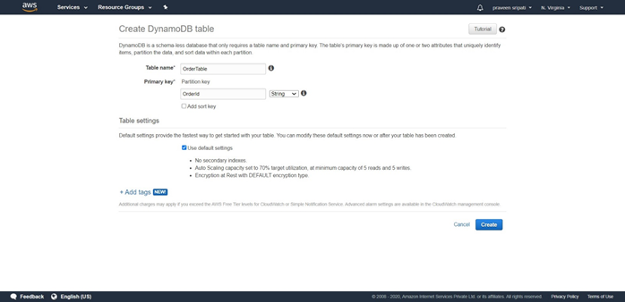
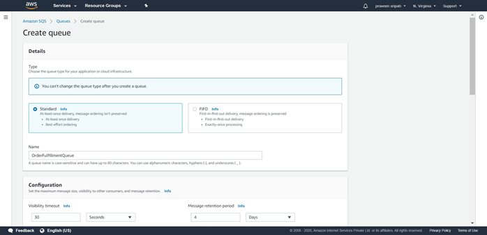
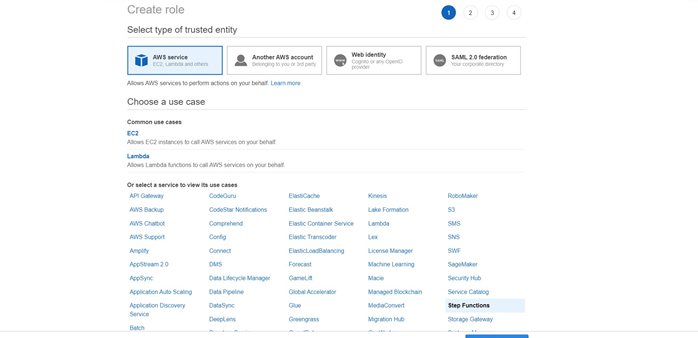
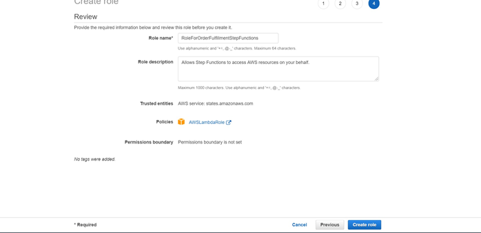
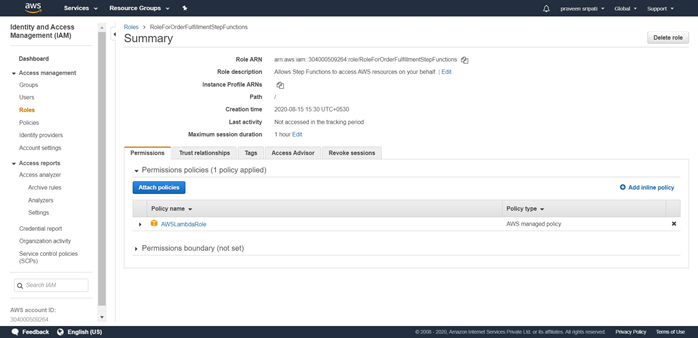
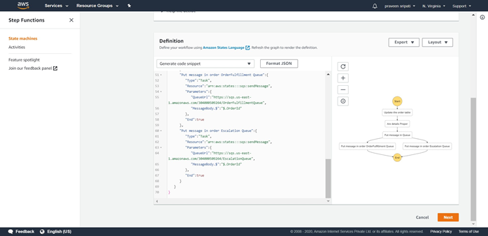
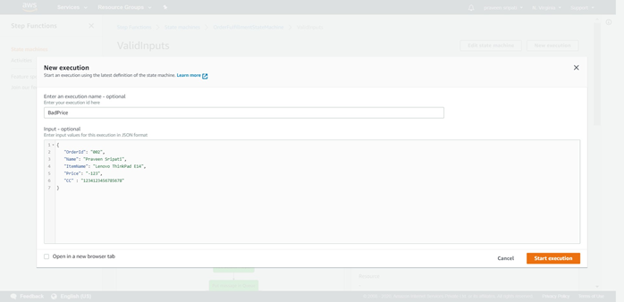
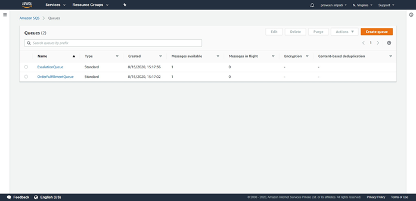
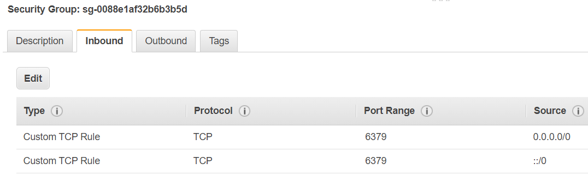

# Topics

    - Creating workflows with AWS StepFunctions.
    - Using ElastiCache to speed up websites (Python, NodeJS).

# Workflows with StepFunctions

## Theory

In real world we have applications which have components spread across different servers/locations which requires coordination and the same has to be managed by the application code and it becomes complicated with time and also difficult to manage.

To make it easy AWS provides AWS StepFunctions to create workflows which can coordinate application logic across distributed systems as shown below. Here we have an upstream application invoking a workflow with the order details. The workflow will perform the below steps

-	Update the DynamoDB with the order details
-	Check if the order details are proper
-	If proper put a message in the OrderFufillment Queue
-	Else put a message in the Escalation Queue

The downstream application would read the messages from these Queues and process the messages further.\

Below is the workflow as depicted by the AWS StepFunctions. The above and below diagram do represent the same workflow with a different way of representation.\

## Practicals

1. Go to the DynamoDB Management Console and create a table with name as OrderTable and the PartitionKey as OrderId/String. Click on Create. The table would be created in a few minutes with no Items as shown below.\

1. Go to the SQS Management Console and click on `Create queue`. Specify the Queue name as `OrderFulfillmentQueue` and click on `Create queue`. The default options are good enough. Once created note down the URL of the Queue.\

1. Similarly create another Queue `EscalationQueue` and note down the Queue URL.

1. Go the IAM Management Console and create a Role for Lambda with the `AWSLambdaBasicExecutionRole` policy. The same would be attached to the Lambda function later.\

1. Go to the Lambda Management Console and click on `Create function`. Enter the function name as VerifyCCAndPrice, select Python2.7 as the Runtime,  expand `Choose or create an existing role` and select `Choose an existing role`. Select the IAM Role created in the previous steps. Click on “Create function”.

1. Replace the Python code with the code from the `lambda-order-validation.py` file. The Lambda checks for the validity of the Credit Card and Price and returns the appropriate StatusCode with other details. Click on Save.\

1. Go back to the IAM Management Console and create a Role. Select the Step Functions as the Service which is going to use this Role. Click on Next.\

1. Click on `Next`. Enter the Role name as RoleForOrderFulfillmentStepFunctions” and click on “Create role”.\

1. Click on “Attach policies” and add the below additional policies to the Role.
	- AmazonSQSFullAccess
	- AmazonDynamoDBFullAccess
	- AmazonLambdaBasicExecutionRole\

1. The Role should be created as shown below.\

1. Go to the Step Functions Management Console and click on `Burger` on the top left and click on `State machines`. Click on `Create state machine`.\

1. Go with the default options. Paste the JSON from `order-fulfillment.json` file in the definition. This defines the workflow. Click on the refresh button and notice the workflow on the right pane getting updated as shown below. Make sure to replace the Lambda ARN and SQS URL for both the Queues in the JSON code. Click on Next.\

1. Specify the state machine name as “OrderFulfillmentStateMachine”. Select the “Choose an existing role” options under permissions and select the Role which has been created for State Functions earlier. This will give the permissions to the state machine to interact with the different AWS Services. Go with the rest of the default options and click on “Create state machine”.\

1. The state machine would be created as shown below.\

1. The state machine takes JSON as the input. `input.txt` file has some sample inputs which can be used with the workflow.

1. Click on “Start execution” and enter a valid JSON and again click on “Start execution”.\

1. The “Execution Status” should be succeed as shown below. And the workflow should be as shown below. Notice the path in the workflow.\

1. Go to the DynamoDB Management Console and an item should be inserted into the table.\

1. Go to the SQS Management Console and there should be an item in the OrderFulfillmentQueue for the downstream applications to process it further.\

1. This time execute the workflow with an invalid message. In the below screen, notice that the price is negative.\

1. The workflow should appear as shown below.\

1. An item should be inserted into the DynamoDB table.\

1. A message would be put in the EscalationQueue for the downstream application to be processed further.\

1. Go to the CloudWatch Management Console and any error messages from the Lambda execution should appear hear if any.\

## Further Reading

1. Use cases for the Step Functions.
   - https://aws.amazon.com/step-functions/use-cases/

1. Amazon States Language
   - https://docs.aws.amazon.com/step-functions/latest/dg/concepts-amazon-states-language.html

1. Supported AWS Service Integrations for Step Functions
   - https://docs.aws.amazon.com/step-functions/latest/dg/connect-supported-services.html

1. Standard vs. Express Workflows
   - https://docs.aws.amazon.com/step-functions/latest/dg/concepts-standard-vs-express.html

1. Step Functions tutorials
   - https://docs.aws.amazon.com/step-functions/latest/dg/tutorials.html

1. Step Functions Projects
   - https://docs.aws.amazon.com/step-functions/latest/dg/create-sample-projects.html
   - https://aws.amazon.com/getting-started/hands-on/create-a-serverless-workflow-step-functions-lambda/
   - https://aws.amazon.com/getting-started/hands-on/handle-serverless-application-errors-step-functions-lambda/
   - https://aws.amazon.com/getting-started/hands-on/scheduling-a-serverless-workflow-step-functions-cloudwatch-events/
   - https://medium.com/weareservian/serverless-data-processing-with-aws-step-functions-an-example-6876e9bea4c0
   - https://docs.aws.amazon.com/solutions/latest/video-on-demand/welcome.html

1. Step Functions vs GCP Workflows
   - https://www.tbray.org/ongoing/When/202x/2020/09/21/AWS-Step-Functions-vs-GCP-Workflows

# ElasticCache (for speeding up websites)

## Theory

Amazon ElastiCache allows you to seamlessly set up, run, and scale popular open-source compatible in-memory data stores in the cloud. Build data-intensive apps or boost the performance of your existing databases by retrieving data from high throughput and low latency in-memory data stores. Amazon ElastiCache is a popular choice for real-time use cases like Caching, Session Stores, Gaming, Geospatial Services, Real-Time Analytics, and Queuing.\

## Practicals

## Common for Python and JS

1. Create an Ubuntu EC2 instance (t2.medium) and connect to to it.

1. Execute the below commands on the EC2 instance.
   >sudo apt-get update

1. Create a Security Group from the EC2 console as shown below and select the same.\

1. Create an ElastiCache Cluster (cache.t2.micro) and get the endpoint once the cluster has been created.

    - Select Redis for engine
    - Select `Amazon Cloud` for location
    - Give a name
    - Change the node type to `cache.t2.micro`
    - Change the `number of replicas` to 1.
    - Uncheck `Multi-AZ`.
    - Select the SecurityGroup created earlier.
    - Uncheck `Enable automatic backups`.
    - Click on create.
    - Wait for a few minutes and note down the `Primary Endpoint`.\

## Python program to interact with Redis

1. Install python and pip.
   >sudo apt-get install python3 python3-pip -y

1. Install the redis connector for python.
   >pip3 install redis

1. In the below python file change the redis_url with the above endpoint. Copy the python code to the EC2 with the same filename.

    1. check-tuple.py
    1. delete-tuple.py
    1. insert-tuple.py

1. Execute the below command to insert a tuple in the ElastiCache Redis Cluster.
    >python insert-tuple-redis.py age 25

1. Get the tuple back from the ElastiCache Redis Cluster. It should return 25.
   >python check-tuple-redis.py age

1. Delete the tuple from the ElastiCache Redis Cluster.
   >python delete-tuple-redis.py age

1. Try to get the tuple "age" and it shouldn't return anything.
   >python check-tuple-redis.py age

## JS program to interact with Redis

1. Execute the below commands on the EC2 instance.

    >sudo apt install nodejs npm -y

1. Create a folder in EC2.

   >mkdir js\
   >cd js

1. From the same folder execute the below command to install the `node_redis` module. A `node_modules` subdirectory will be automatically created.

   >npm install redis

1. Copy the files in the `elasti-cache-js-code` folder to `js` folder in the EC2 instance. Make sure to replace the endpoint in the code.

1. Execute the below commands to put, get and delete detete the data from the Redis cluster.

   >node insert-tuple-redis.js\
   >node  check-tuple-redis.js\
   >node delete-tuple-redis.js

## Further Reading

1. Home Page
   - https://aws.amazon.com/elasticache/

1. Cache 101
   - https://cloudonaut.io/caching-on-aws-101/

1. UseCases
   - https://docs.aws.amazon.com/AmazonElastiCache/latest/mem-ug/elasticache-use-cases.html

1. Integrating Memcached with WordPress
   - https://aws.amazon.com/elasticache/memcached/wordpress-with-memcached/ 

1. Getting started with Memcached
   - https://docs.aws.amazon.com/AmazonElastiCache/latest/mem-ug/GettingStarted.html

1. Connecting to the node through Telnet
   - https://docs.aws.amazon.com/AmazonElastiCache/latest/mem-ug/nodes-connecting.html
   - https://www.tutorialspoint.com/memcached/memcached_add_data.htm

1. Interfacing with Memcached
   - https://docs.aws.amazon.com/AmazonElastiCache/latest/mem-ug/nodes-connecting.html
   - https://www.tutorialspoint.com/memcached/memcached_add_data.htm