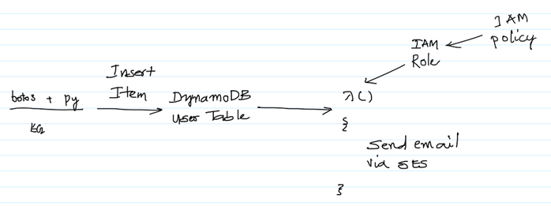
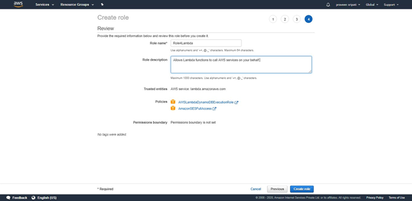
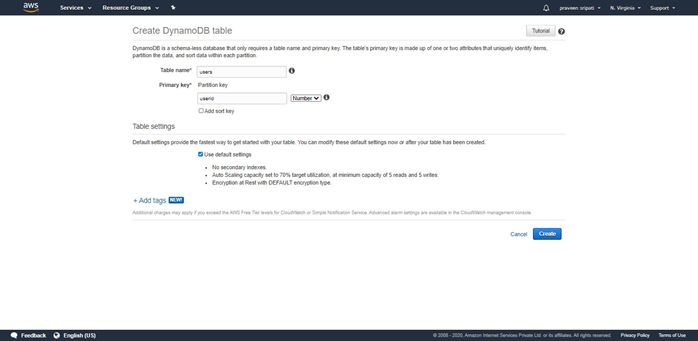
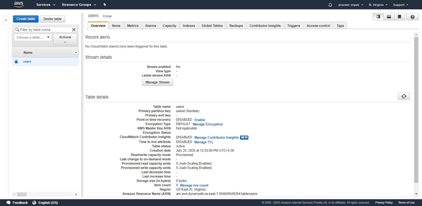
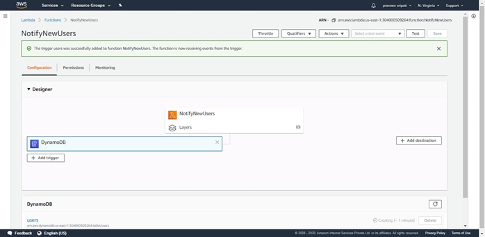
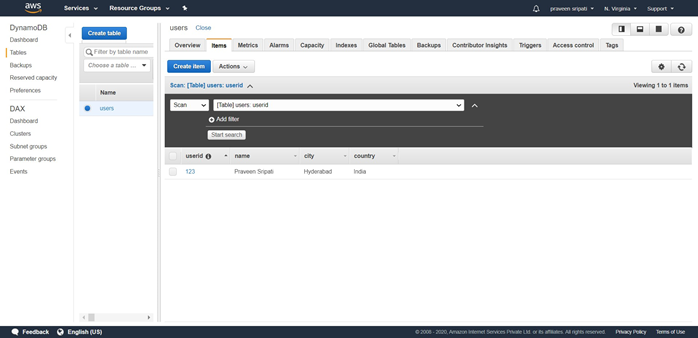
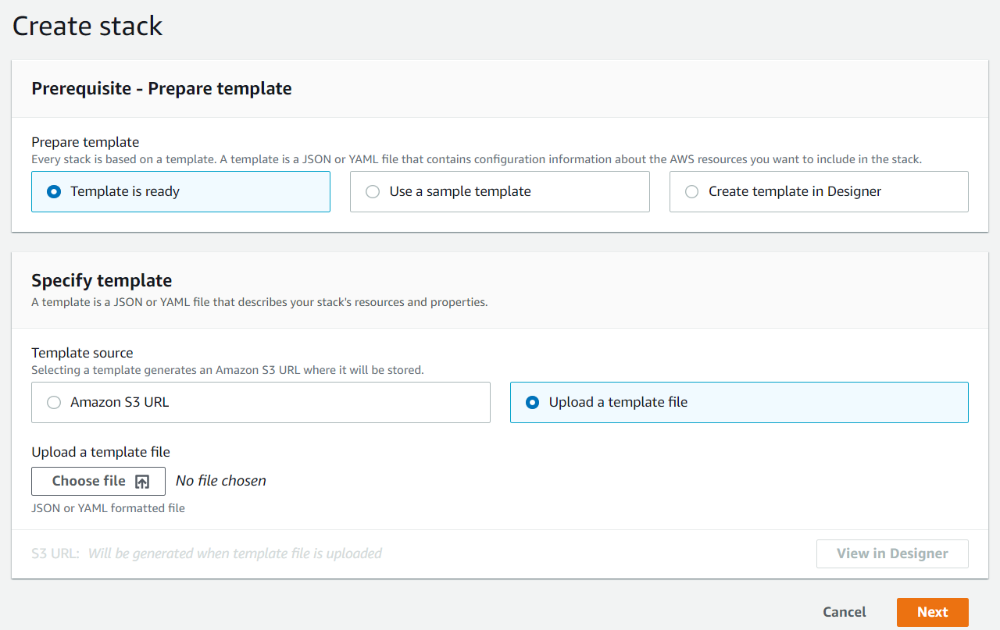
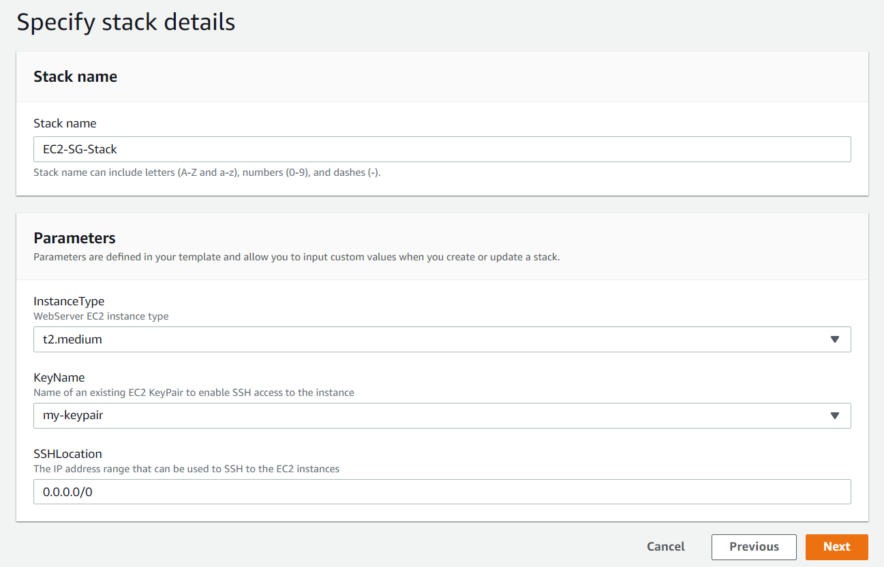

# Topics

    - What is DynamoDB? Integration of the applications with the DynamoDB (Python, NodeJS).
    - Automating the AWS resource creation using CloudFormation.

# Working with DynamoDB

## Theory

1. Amazon Prime Infrastructure

1. Internal AWS migration to AWS Databases

1. DynamoDB vs RDBMS table structure

1. Schemaless DB (Primary Key = Partition Key (M) + Sort Key (O))

1. Operations allowed on DynamoDB

1. Interacting with DynamoDB from different languages

1. Serverless (RCU and WCU)

1. Setting up DynamoDB Locally

1. DynamoDB WorkBench

1. SQL on DynamoDB

1. Global tables

## Practical

1. From the SES Management Console, verify two email addresses for the sender and the receiver.

1. Create an IAM Role for Lambda with the `AWSLambdaDynamoDBExecutionRole` and `AmazonSESFullAccess` policies.\

1. Create a Lambda function (Python or JS) to send an email. Attach the above Role to the Lambda.

1. Go to the DynamoDB Management Console and create a table with the below details. Go with the default options.
    >Table name – users\
    >Primary key – userid (Number)\

1. For the table click on `Manage Streams` and enable the stream.\
\

1. Go back to the Lambda Management Console and click on `Add trigger`.\

1. Select the DynamoDB service and select the `users` table created earlier. Go with the rest of the default options and click on “Add”. This integrates the DynamoDB table with the Lambda function via Triggers.\

1. Create an IAM Role for EC2 with the `AmazonDynamoDBFullAccess` Policy attached to it.

1. Create Ubuntu EC2 and connect to it. Attach the above created IAM Role to the EC2 instance.

1. Install python3, python3-pip and boto3 on the EC2 instance.

1. Copy the `dynamodb-put.py` code to the EC2 instance and execute the Python program.

1. A new item would be inserted into the DynamoDB table.\

1. The Item would be triggering the Lambda function which would send an email via SES.\

## Further Reading

### General

1. Amazon Prime Infrastructure (including DynamoDB)
    - https://aws.amazon.com/blogs/aws/how-aws-powered-amazons-biggest-day-ever/
    - https://aws.amazon.com/blogs/aws/amazon-prime-day-2019-powered-by-aws/
    - https://aws.amazon.com/blogs/aws/amazon-prime-day-2020-powered-by-aws/

1. Migration Complete
    - https://aws.amazon.com/blogs/aws/migration-complete-amazons-consumer-business-just-turned-off-its-final-oracle-database/

1. How to know if DynamoDB is appropriate?
    - https://aws.amazon.com/blogs/database/how-to-determine-if-amazon-dynamodb-is-appropriate-for-your-needs-and-then-plan-your-migration/

1. DynamoDB Core Components?
    - https://docs.aws.amazon.com/amazondynamodb/latest/developerguide/HowItWorks.CoreComponents.html

1. Storing JSON documents in Amazon DynamoDB tables
    - https://aws.amazon.com/blogs/developer/storing-json-documents-in-amazon-dynamodb-tables/

1. Best Practices for DynamoDB
    - https://docs.aws.amazon.com/amazondynamodb/latest/developerguide/best-practices.html

1. Fine-Grained access Control
    - https://aws.amazon.com/blogs/aws/fine-grained-access-control-for-amazon-dynamodb/

1. Write Consistency (Eventual and Strong)
    - https://docs.aws.amazon.com/amazondynamodb/latest/developerguide/HowItWorks.ReadConsistency.html

1. RCU and WCU (Serverless)
    - https://docs.aws.amazon.com/amazondynamodb/latest/developerguide/HowItWorks.ReadWriteCapacityMode.html
    - https://aws.amazon.com/dynamodb/pricing/provisioned/

### Backup and Restore

1. On-Demand Backup and Restore for DynamoDB
    - https://docs.aws.amazon.com/amazondynamodb/latest/developerguide/BackupRestore.html

1. Point-in-Time Recovery: How It Works
    - https://docs.aws.amazon.com/amazondynamodb/latest/developerguide/PointInTimeRecovery.html

### Interfaces

1. Operations allowed on DynamoDB
    - https://docs.aws.amazon.com/amazondynamodb/latest/APIReference/API_Operations_Amazon_DynamoDB.html

1. Interacting with DynamoDB from different languages
    - https://docs.aws.amazon.com/amazondynamodb/latest/developerguide/GettingStarted.html

1. Interacting with DynamoDB from Web Console
    - https://aws.amazon.com/getting-started/tutorials/create-nosql-table/

1. Setting up DynamoDB Locally
    - http://docs.aws.amazon.com/amazondynamodb/latest/developerguide/DynamoDBLocal.html

1. DynamoDB WorkBench
    - https://docs.aws.amazon.com/amazondynamodb/latest/developerguide/workbench.html

1. SQL on DynamoDB
    - https://github.com/fsprojects/DynamoDb.SQL
    - https://www.simba.com/products/DynamoDB/doc/ODBC_InstallGuide/win/content/odbc/dy/features/sqlinterface.htm
    - https://www.razorsql.com/features/dynamodb_sql_editor.html

### Pricing

1. WCU and RCU Pricing
    - https://aws.amazon.com/dynamodb/pricing/provisioned/

# Automation using the CloudFormation

## Theory

CloudFormation Templates allow automation of the resource management in AWS. CloudFormation is similar to Ansible, Terraform and other. The only differentiation is that CloudFormation is very specific to AWS.

1. `ec2-sg.creation.json` and `ec2-sg.creation.yaml` create a Security Group when a stack is created out of it.

2. `ec2-sg-creation.json` and `ec2-sg-creation.yaml` creates an EC2 instance, a Security Group and connects both of them.

More complicated CloudFormation sample templates can be found in the AWS documentation [here](https://docs.aws.amazon.com/AWSCloudFormation/latest/UserGuide/cfn-sample-templates.html).

High level steps for CloudFormation
	- Add and connect resources
	- Add template parameters, mapping and outputs
	- Specify resource properties
	- Provision resources

Coming to the pricing, CloudFormation as is free. But, there is a cost associated with any resources created by the CloudFormation.

## Practical

1. Go to the CloudFormation Management Console.

1. Click on `Create stack`.

1. Click on `Upload a template file`.\

1. Click on `Choose file` and point to the `ec2-sg-creation.json` from the local machine. Click on `Next`.

1. Give the stack a name, select the instance type as `t2.medium`, keypair and the SSH location as shown below. Click on `Next`.\

1. Go with all the default options and click on `Next`.

1. Review the stack details and click on `Create stack`.

1. In a few minutes, the status of the stack should change to `CREATE COMPLETE` as shown below.\

1. The resources mentioned in the CloudFormation template would be in `CREATE_COMPLETE` state.\

1. The EC2 details should be specified in the `Outputs` tab.\

1. Go to the EC2 Management Console and there should be an EC2 of type t2.medium in a `running` state in a few minutes.\

1. Also, there should be a Security Group created as shown below.\

1. Go back to the CloudFormation Management Console and delete the Stack.\

1. Notice from the EC2 Management Console that the EC2 would be terminated and the Security Group created earlier would be automatically **deleted**.

## Further Reading

1. AWS CloudFormation
	- https://aws.amazon.com/cloudformation/

1. Comparing CloudFormation with other similar tools
	- https://cloudonaut.io/cloudformation-vs-terraform/
	- https://ryaneschinger.com/blog/aws-cloudformation-vs-terraform/
	- https://www.thecloudavenue.com/2020/09/aws-infrastructure-provisioning-with-ansible.html

1. List of AWS Resources Supported
	- https://docs.aws.amazon.com/AWSCloudFormation/latest/UserGuide/using-cfn-stack-drift-resource-list.html

1. AWS resource and property types reference
	- https://docs.aws.amazon.com/AWSCloudFormation/latest/UserGuide/aws-template-resource-type-ref.html

1. Template anatomy
	- https://docs.aws.amazon.com/AWSCloudFormation/latest/UserGuide/template-anatomy.html

1. Sample CloudFormation Templates
	- https://docs.aws.amazon.com/AWSCloudFormation/latest/UserGuide/sample-templates-services-us-east-1.html
	- https://github.com/widdix/aws-cf-templates
	- https://github.com/cfn-modules/docs

1. Walkthroughs for auto generating the Template code 
	- https://docs.aws.amazon.com/AWSCloudFormation/latest/UserGuide/CHAP_Using.html

1. Rollback on failure
	- https://aws.amazon.com/premiumsupport/knowledge-center/cloudformation-prevent-rollback-failure/

1. Nested stacks (for reusability)
	- https://docs.aws.amazon.com/AWSCloudFormation/latest/UserGuide/using-cfn-nested-stacks.html

1. Change Sets (previewing the changes when updating a Stack)
	- https://docs.aws.amazon.com/AWSCloudFormation/latest/UserGuide/using-cfn-updating-stacks-changesets.html

1. Detect drift on an entire CloudFormation stack
	- https://docs.aws.amazon.com/AWSCloudFormation/latest/UserGuide/detect-drift-stack.html

1. Bringing existing resources into CloudFormation management
	- https://docs.aws.amazon.com/AWSCloudFormation/latest/UserGuide/resource-import.html

1. Linter
	- https://github.com/aws-cloudformation/cfn-python-lint