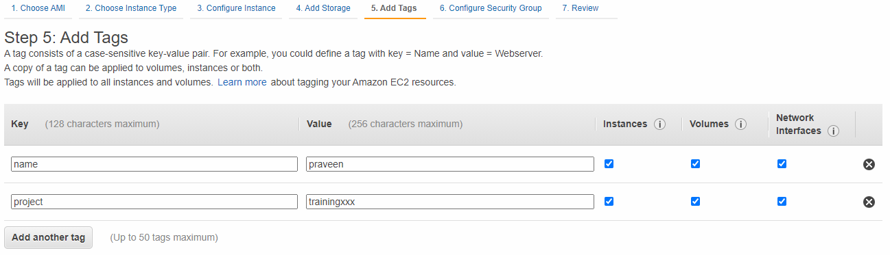

# Warming Up

1. We will try to make the sessions interactive with a lot of labs/demos as we progress. The assumption is that all of us know what Cloud is and it's pros/cons and so we will skip this part. Another assumption is that all of you have an account with AWS.

1. All the participants will be muted by default, please keep it muted. If you have any query then you can unmute yourself and ask me. Once the query is resolved, please mute back yourself. This way we can have a smooth session without any background noises.

1. If you are stuck, please let me know and I will enable you to share the screen and we can resolve the problem faster.

1. Recording of the session is now allowed. So, please don't use any recording feature.

1. Everything will be shared via Github. AWS is making constant changes to the UI and rolling them slowly to users. The images in the github documentation might not reflect the latest AWS screen. But, the overall procedure is all the same.

1. Any resources created in the AWS account have to be tagged as shown below. This way, we can keep track of who has created a particular resource and also helps with the billing. Note that tags are case sensitive and lets use lower case. Make sure to replace `trainingxxx` with something appropriate like `training004`.\

1. Keep the resource usage to the minimum, like create an EC2 instance with t2.micro where ever possible.

1. Also, **undo** the resource creation immediately once done with the lab. Like terminating an EC2 instance, deleting an S3 bucket etc. This would keep the billing to the minimum and also minimize the security risk.

# Creating resources in VPC (EC2, RDS, Aurora etc)

## Option 1 (without VPN)

1. Select the **default** VPC the one with the CIDR starting with **172.31** as shown below. Check for the VPC in NV or Oregon and stick to that region for the demos.

1. While creating the Security Group, make sure that the Inbound rules has **0.0.0.0/0** for the source. This will allow connection to the AWS resources from the McAfee network.

## Option 2 (with VPN)

1. Make sure you are connected to the VPN.

1. Select the **spoke** VPC.

1. Make sure to select the subnet which doesn't have a word **reserved** in it.

1. While creating the Security Group, make sure that the Inbound rules has **10.0.0.0/8** for the source as shown below. This will allow connection to the AWS resources from the McAfee network.\

# Agenda

- **Session 1**

    - Introductions and basics of AWS (EC2, ELB, CloudWatch, S3 and VPC)

- **Session 2**

    - Create an Application ELB and showcase the path based routing
    - Register a domain with Freenom and use Route53 to provide a user friendly alternative to the ELB DNS name
    - Using Cost Explorer to measure and minimize costs
    - Using tags to attribute the costs

- **Session 3**

    - Significance of SDK and CLI
    - Setup of the CLI and SDK (Python, NodeJS)
    - Trying out different commands and programs to interact with the AWS Services

- **Session 4**

    - What is SQS? Integration of the applications with SQS (Python, NodeJS)
    - What is SNS? Difference between SNS and SQS
    - What is Event Bridge? Using it for notification around AWS Resource changes

- **Session 5**

    - What is Serverless? The different services around serverless from AWS
    - Introduction to Lambda. Different ways of invoking Lambda.
    - Invoking Lambda via CloudWatch Scheduler and CloudWatch Events  (Python, NodeJS)
    - Analyzing the Lambda Logs using CloudWatch Insights

- **Session 6**

    - Creating workflows with AWS StepFunctions
    - Using ElastiCache to speed up websites (Python, NodeJS)

- **Session 7**

    - What is DynamoDB? Integration of the applications with the DynamoDB (Python, NodeJS)
    - Automating the AWS resource creation using CloudFormation

- **Session 8**

    - What is Aurora and different features of Aurora?
    - How is Aurora different from the RDBMS?
    - Optimization techniques in Aurora
    - Creating an Aurora DB along with exploring the different features

- **Session 9**

    - Introduction to Docker and K8S
    - How are AWS and K8S related to each other
    - Different ways of setting up an ECS and EKS Cluster in AWS
    - Creating a Docker Container with a static page
    - Registering the Container with AWS ECR
    - Setting up an EKS Cluster with Fargate and deploy above container
    - Setting up an ECS Cluster without Fargate and deploy above container

- **Session 10**

    - Auto Scaling of EC2 instances
    - Using Jumpbox/Bastion Box for connecting to EC2 instances
    - Project
        - Gathering Custom Metrics in the CloudWatch and creating DashBoards
        - AutoScaling of the EC2 instances using the above Custom Metrics